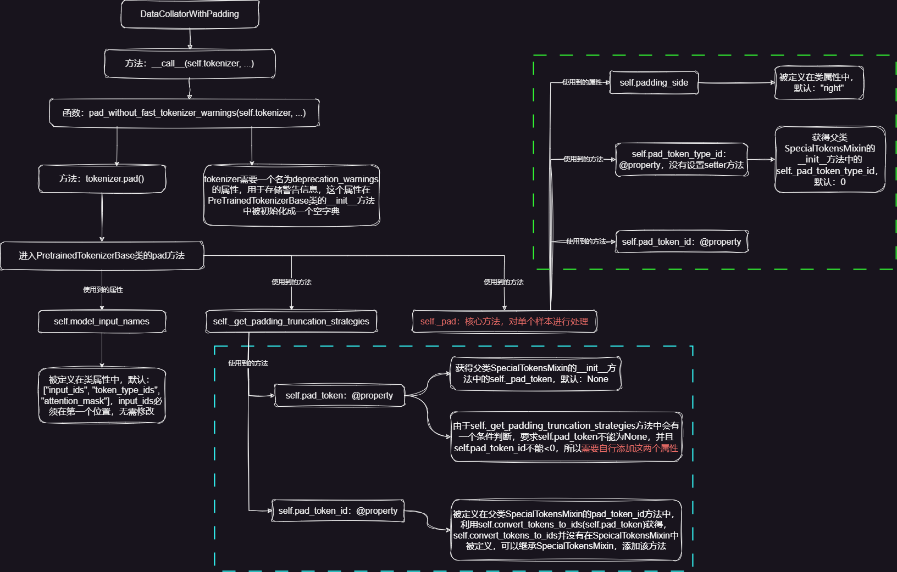

{: box-sucess}
最近遇到一个问题，做nlp的时候很多tokenizer都是直接从huggingface hub上拉下来的或者用自己的文本语料训练出来的。但是在生物信息学领域，以单细胞转录组大模型geneformer为例，每个样本是一个细胞，每个token是一个gene，我们并不需要进行分词操作（相当于已经分好词了），我们完全可以自己定义一个Tokenizer类，用于将gene转换成id，并进行截断，填充，加特殊字符等操作。由于我后续想要使用transformers中的DataCollatorForLanguageModeling，但是实例化这个类时必须要传入一个tokenizer，如果我想要使用这个datacollator，我必须搞清楚它使用了tokenizer中的哪些属性和方法，然后自定义一个"伪"tokenizer或者将必要的属性和方法融入我自定义的Tokenizer类，使两者能够相互适配~（主要是因为太懒了，不想自己重新写一个datacollator，而且这样做效率不一定比官方实现的高，不优雅）🤷‍♂️

**后面我就探索了一下DataCollatorWithPadding和DataCollatorForLanguageModeling，这两个也是平时最常使用的两个data_collator**

- 数据集下载链接：[download_dataset](https://github.com/zyds/transformers-code/tree/master/02-NLP%20Tasks/14-language_model/wiki_cn_filtered)
- DEBUG：
```python
import os
os.environ["HF_ENDPOINT"] = "https://hf-mirror.com"
os.environ["HF_HOME"] = "~/hf"

from datasets import load_from_disk
from torch.utils.data import DataLoader
from transformers import AutoTokenizer, DataCollatorWithPadding, DataCollatorForLanguageModeling


# load and preprocess dataset
ds = load_from_disk("./data/wiki_cn_filtered/")
tokenizer = AutoTokenizer.from_pretrained("hfl/chinese-macbert-base")

def process_func(examples):
    return tokenizer(examples["completion"], max_length=384, truncation=True)

tokenized_ds = ds.map(process_func, batched=True, remove_columns=ds.column_names)


# dataloader, using different data_collator
dl = DataLoader(tokenized_ds, batch_size=2, collate_fn=DataCollatorWithPadding(tokenizer))
# dl = DataLoader(tokenized_ds, batch_size=2, collate_fn=DataCollatorForLanguageModeling(tokenizer, mlm=True, mlm_probability=0.15))

next(iter(dl))
```

## 1. DataCollatorWithPadding

{: .mx-auto.d-block :}

{: .box-note}
**Note:** 根据以上源码逻辑，我们似乎只需要继承`PretrainedTokenizerBase`类，自定义必要属性即可，具体的函数实现无需修改，其中：`pad_token`和`pad_token_id`属性是必须要添加的，`pad_token`可以通过调用`SpecialTokensMixin`的init方法帮助我们添加，`pad_token_id`可以通过定义`convert_tokens_to_ids`方法隐式添加，我们也可以在类属性中设置`padding_side`，确定填充的位置，话不多说，直接上代码🥱~

### 1.1 暴力修改

```python
from transformers import PreTrainedTokenizerBase, DataCollatorWithPadding

class PreCollator(PreTrainedTokenizerBase):
    pad_token = ["PAD"]
    pad_token_id = 0
    padding_side = "right"

precollator = PreCollator()
data_collator = DataCollatorWithPadding(precollator)


samples = [{"input_ids": [1, 2, 3], "token_type_ids": [0, 0, 0], "attention_mask": [1, 1, 1], "labels": 1},
           {"input_ids": [4, 5], "token_type_ids": [0, 0], "attention_mask": [1, 1], "labels": 0}]

data_collator(samples)
```

### 1.2 更加优雅的方式

```python
from typing import Union, List
from transformers import PreTrainedTokenizerBase, DataCollatorWithPadding

vocab = {
    "[PAD]": 0,
    "[UNK]": 1,
    "[CLS]": 2,
    "[SEP]": 3,
    "[MASK]": 4,
    # ...
}

class PreCollator(PreTrainedTokenizerBase):

    padding_side = "right"

    def convert_tokens_to_ids(self, tokens: Union[str, List[str]]) -> Union[int, List[int]]:
        """
        Converts a token string (or a sequence of tokens) in a single integer id (or a sequence of ids), using the
        vocabulary.

        Args:
            tokens (`str` or `List[str]`): One or several token(s) to convert to token id(s).

        Returns:
            `int` or `List[int]`: The token id or list of token ids.
        """
        if tokens is None:
            return None

        if isinstance(tokens, str):
            return self._convert_token_to_id_with_added_voc(tokens)

        ids = []
        for token in tokens:
            ids.append(self._convert_token_to_id_with_added_voc(token))
        return ids
    

    def _convert_token_to_id_with_added_voc(self, token):
        if token is None:
            return None

        return vocab.get(token)
    

precollator = PreCollator(pad_token="[PAD]")
data_collator = DataCollatorWithPadding(precollator)


samples = [{"input_ids": [1, 2, 3], "token_type_ids": [0, 0, 0], "attention_mask": [1, 1, 1], "labels": 1},
           {"input_ids": [4, 5], "token_type_ids": [0, 0], "attention_mask": [1, 1], "labels": 0}]

data_collator(samples)
```

😂 虽然优雅，但是需要对源码有充分的理解 ~

## 2. DataColloatorForLanguageModeling

- 完善中......
